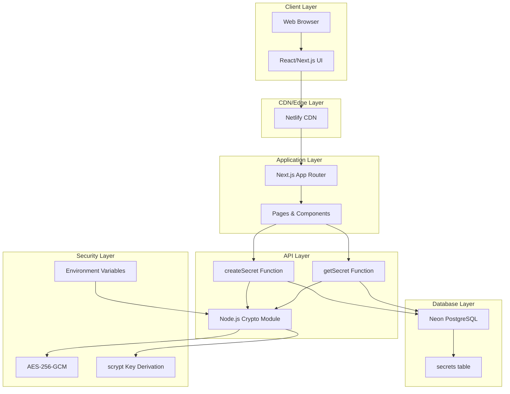
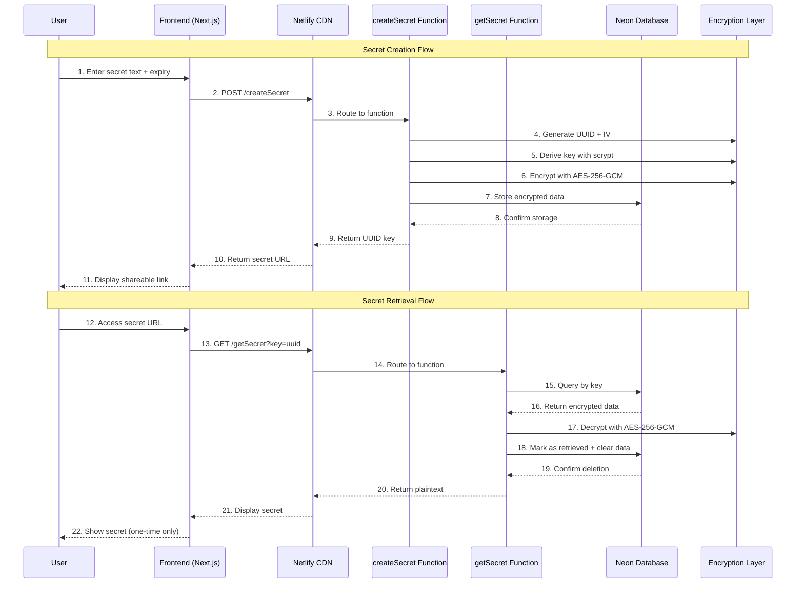
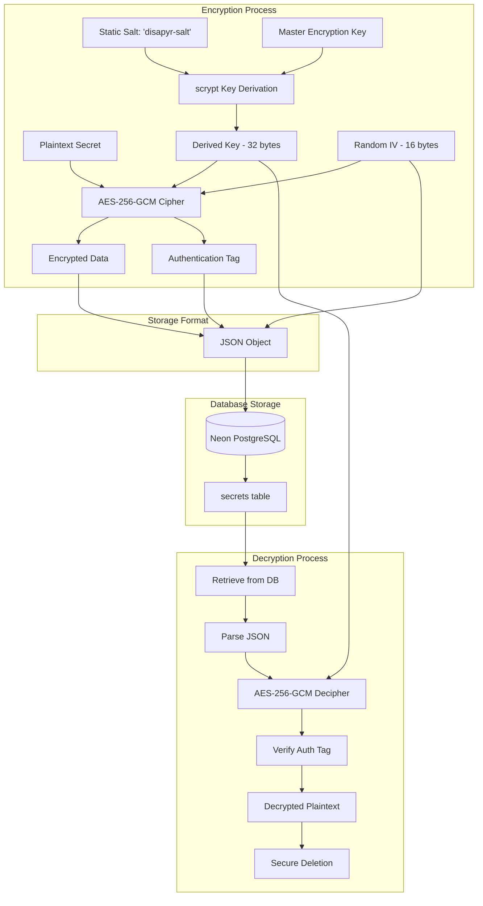
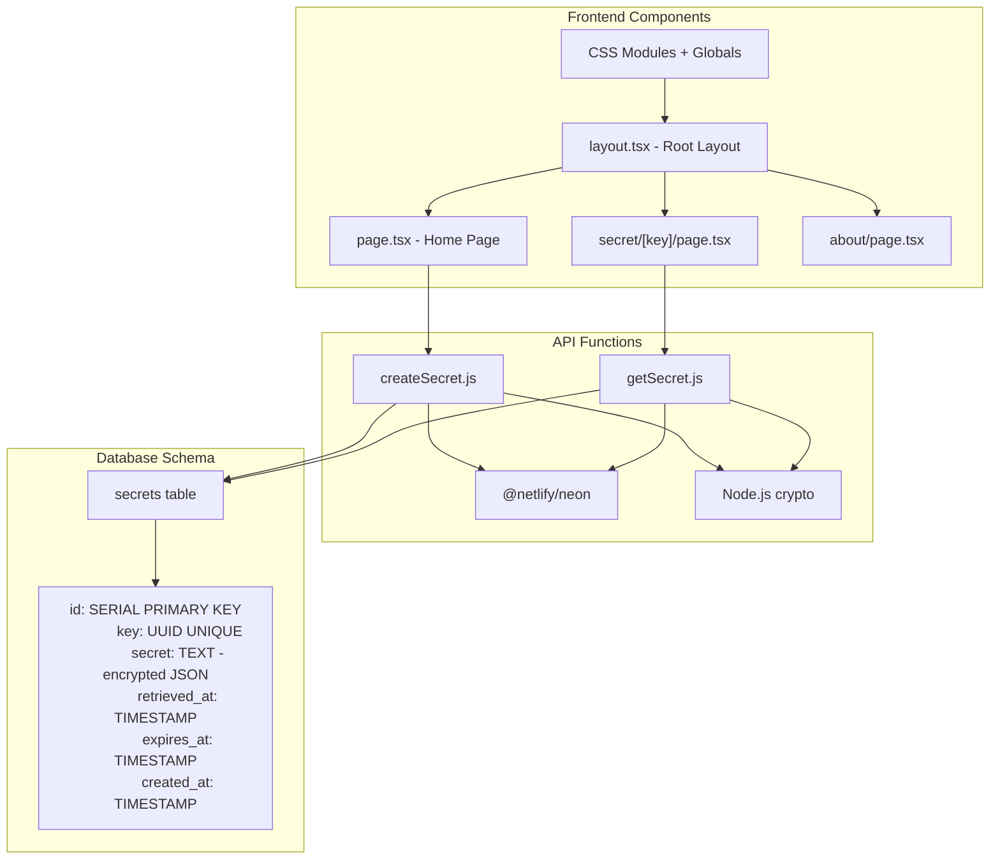
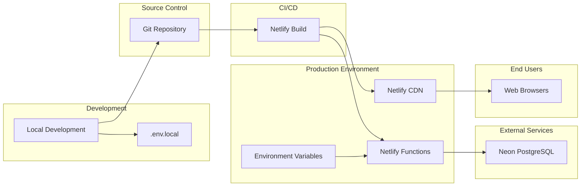
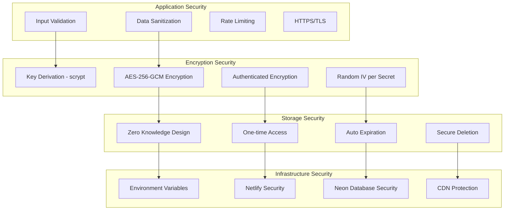
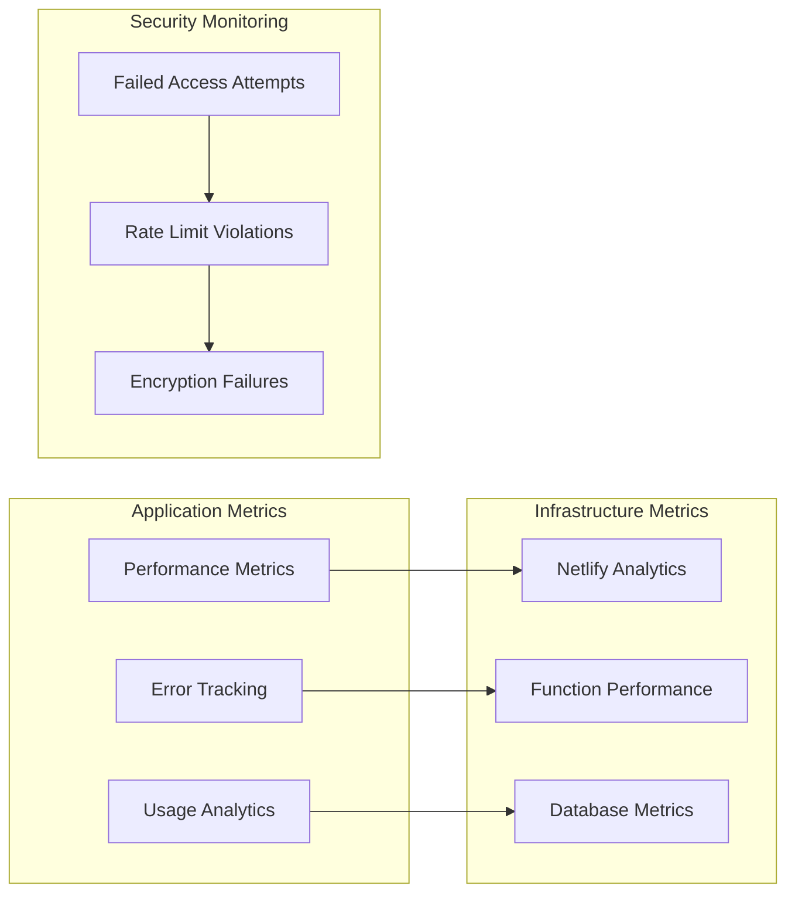

# disapyr.link Architecture Documentation

## System Overview

disapyr.link is a secure, serverless text-sharing application built with a zero-knowledge architecture. The system uses end-to-end encryption to ensure that sensitive data remains protected throughout its lifecycle, with automatic deletion after one-time access.

## High-Level Architecture

## Data Flow Architecture

## Security Architecture

## Component Architecture

## Deployment Architecture

## Security Layers

## Key Architectural Decisions

### 1. **Serverless Architecture**
- **Choice**: Netlify Functions for API endpoints
- **Rationale**: Automatic scaling, reduced operational overhead, pay-per-use model
- **Trade-offs**: Cold start latency, vendor lock-in

### 2. **Zero-Knowledge Design**
- **Choice**: Client-side URL generation, server-side encryption
- **Rationale**: Service provider cannot access plaintext secrets
- **Implementation**: Encryption keys stored separately from database

### 3. **One-Time Access Pattern**
- **Choice**: Immediate deletion after retrieval
- **Rationale**: Prevents replay attacks and accidental exposure
- **Implementation**: Database UPDATE with NULL overwrite

### 4. **AES-256-GCM Encryption**
- **Choice**: Authenticated encryption with associated data (AEAD)
- **Rationale**: Provides both confidentiality and authenticity
- **Implementation**: Unique IV per secret, scrypt key derivation

### 5. **React/Next.js Frontend**
- **Choice**: Modern React with App Router
- **Rationale**: Type safety, SSR capability, developer experience
- **Implementation**: CSS Modules for styling, TypeScript for type safety

## Performance Considerations

### Frontend Optimization
- Next.js automatic code splitting
- CSS Modules for scoped styling
- Responsive images and assets
- Progressive Web App capabilities

### Backend Optimization
- Serverless functions for auto-scaling
- Database connection pooling via Neon
- Minimal data transfer (encrypted JSON only)
- Efficient database queries with indexes

### Security vs Performance Trade-offs
- scrypt key derivation adds computational cost but improves security
- AES-256-GCM provides authenticated encryption with minimal overhead
- One-time access requires immediate database updates but ensures security

## Monitoring and Observability

## Scalability Considerations

### Horizontal Scaling
- Serverless functions auto-scale based on demand
- CDN distribution for global performance
- Database connection pooling for concurrent access

### Vertical Scaling
- Neon PostgreSQL auto-scaling capabilities
- Function memory allocation optimization
- Database query optimization

### Growth Planning
- Monitor function execution times
- Database storage and connection limits
- CDN bandwidth usage
- Rate limiting thresholds

---

## Security Best Practices Implemented

1. **Encryption at Rest**: All secrets encrypted before database storage
2. **Encryption in Transit**: HTTPS/TLS for all communications
3. **Key Management**: Environment-based key storage, separate from data
4. **Access Control**: One-time access with immediate deletion
5. **Input Validation**: Length limits, sanitization, type checking
6. **Error Handling**: No information leakage in error responses
7. **Audit Trail**: Timestamps and access logging
8. **Secure Deletion**: Overwrite with NULL values after access

This architecture ensures a secure, scalable, and maintainable text-sharing service with strong privacy guarantees.
